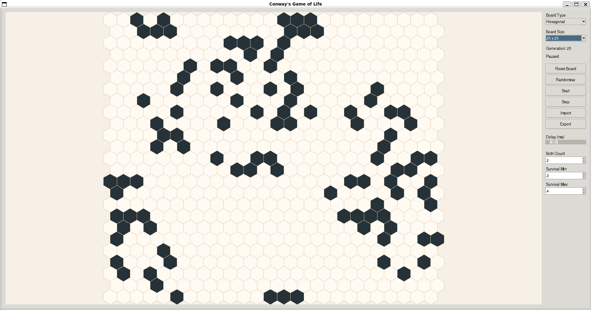

# Game Of Life

An implementation of Conway's Game of Life.

## Description

This project implements Conway’s Game of Life with support for both square and hexagonal cell grids. The simulation backend is written in C, and the graphical frontend is written in Python.

Features include:
 - Square and hexagonal cell modes
 - Custom rule parameters (that can be set by users)
 - Board import and export
 - Terminal-based demo
 - Python GUI frontend
 - C test binaries

## GUI



## Dependencies

The project requires:
 - `gcc` (or another C compiler)
 - `make`
 - `python3`
 - a POSIX environment (for the terminal demo)

And the following Python modules:
 - `ctypes`
 - `enum`
 - `pathlib`
 - `time`
 - `typing`
 - `math`
 - `tkinter`

## Project Structure

```text
.
├── build/                   # Build outputs, including binaries and shared libraries
├── examples/                # Example input/output files
├── test/                    # Test files
├── game_of_life.py          # Python GUI frontend
├── main.c                   # Terminal demo entry point
├── simulation.c             # Game of Life simulation backend
├── simulation.h             # Simulation backend header
├── io_utils.c               # Import/export and utility functions
├── io_utils.h               # Import/export and utility header
├── types_and_constants.h    # Shared types and constants
├── Makefile                 # Build and test commands
├── pyproject.toml           # Python/tooling configuration
├── .clang-format            # C formatting configuration
├── .gitignore               # Git ignore rules
├── usage-example-GUI.png    # Example screenshot of the GUI
└── README.md                # Project documentation
```

## Build

To build the project, from the root directory, run:

```bash
make
```

This creates
 - `build/gol` - the terminal demo of the game, written in C

 - `build/libgol.so` - the C backend library for our game, used in our 
Python frontend

 - And test binaries, in `build/test`

## Run

To run the Python GUI version of the game, build the `libgol.so` library, 
and run the following:

```bash
python3 game_of_life.py
```

For the terminal version of the game, run:

```bash
./build/gol
```

This instantiates a random board set to the size of your terminal, and simulates
1000 generations.

## Testing

To test the project with the included tests, run:

```bash
make test
```
